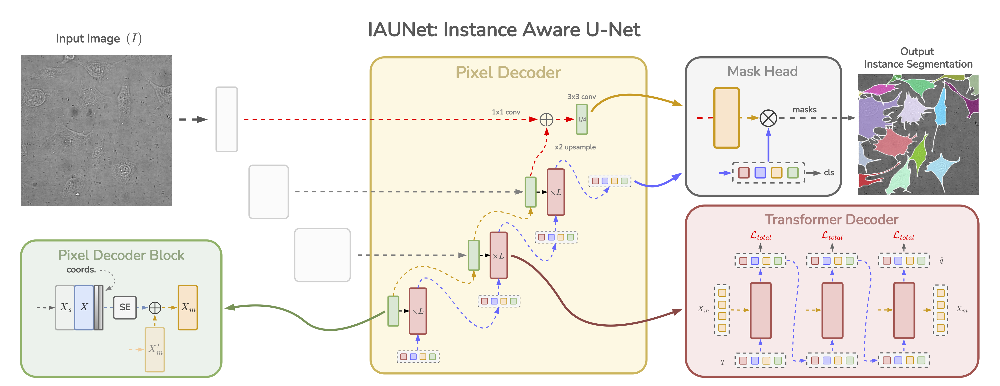
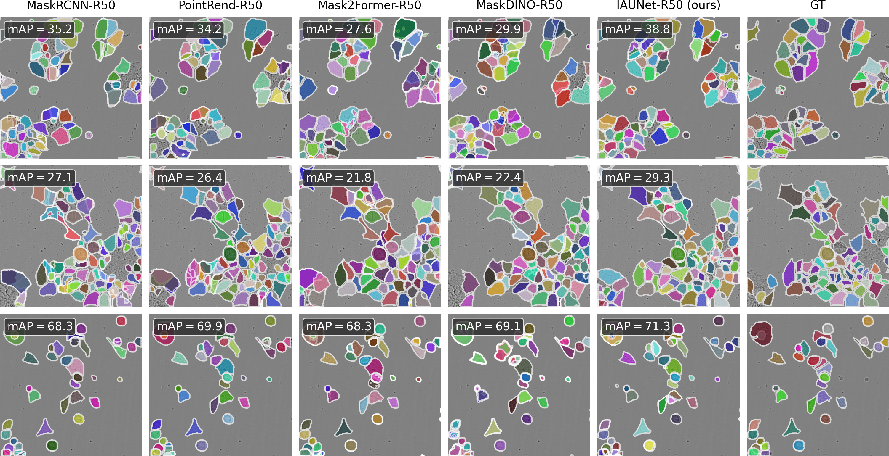

<h1 align="center">IAUNet: Instance-Aware UNet (CVPRW 2025)</h1>

<div align="center">

[](https://www.arxiv.org/abs/2508.01928)
[](https://openaccess.thecvf.com/CVPR2025_workshops/CVMI)
[](https://bcv.cs.ut.ee/)

</div>


<div align="center" style="margin-top: 10px; margin-bottom: 20px;">
    <span class="author-block">
        <a href="https://scholar.google.com/citations?user=RLf-ytQAAAAJ&hl">Yaroslav Prytula</a><sup>1,2</sup>
    </span> &nbsp;|&nbsp;
    <span class="author-block">
        <a href="https://scholar.google.com/citations?user=tnvq360AAAAJ&hl=en">Illia Tsiporenko</a><sup>1</sup>
    </span> &nbsp;|&nbsp;
    <span class="author-block">
        <a href="https://scholar.google.com/citations?user=Y_aAGL8AAAAJ&hl=en">Ali Zeynalli</a><sup>1</sup>
    </span> &nbsp;|&nbsp;
    <span class="author-block">
        <a href="https://scholar.google.com/citations?user=IOuDrrEAAAAJ&hl=en">Dmytro Fishman</a><sup>1,3</sup>
    </span>
    <div class="is-size-5 publication-authors">
      <span class="author-block"><sup>1</sup>Institute of Computer Science, University of Tartu,</span><br>
      <span class="author-block"><sup>2</sup>Ukrainian Catholic University,</span>
      <span class="author-block"><sup>3</sup>STACC OÜ, Tartu, Estonia</span>
    </div>
</div>


<p align="center">
  
</p>

---

This is the official repository for the paper:

> **IAUNet: Instance-Aware U-Net**  
> Yaroslav Prytula, Illia Tsiporenko, Ali Zeynalli, Dmytro Fishman  
> *CVPR Workshops (CVMI), 2025*

**Updates**
- **08/08/2025: ⭐️ Revvity-25 dataset released ([Revvity-25](https://huggingface.co/datasets/YaroslavPrytula/Revvity-25))**
- 01/08/2025: 🔥 IAUNet code release

---

## Table of Contents

- [Installation](#installation)
- [Datasets](#datasets)
  - [Revvity-25](#revvity-25)
  - [ISBI 2014](#isbi-2014)
  - [LiveCell](#livecell)
- [Training the Model](#training-the-model)
- [Inference](#inference)
- [License](#license)
- [Citing IAUNet](#citing-iaunet)

---

## Installation

We recommend using Python 3.9.19 and PyTorch 2.3.1 with CUDA 12.1.

```bash
# Install Python 3.9.19
conda create -n iaunet python=3.9.19 -y
conda activate iaunet

# Install PyTorch 2.3.1 with CUDA 12.1
pip install torch==2.3.1 torchvision==0.18.1 torchaudio==2.3.1 --index-url https://download.pytorch.org/whl/cu121
pip install -U opencv-python

# Clone the repository
git clone https://github.com/SlavkoPrytula/IAUNet.git
cd IAUNet

# Install dependencies
pip install -r requirements.txt
````

---

## Datasets

### Revvity-25

We present the **Revvity-25 Full Cell Segmentation Dataset**, a cutting-edge 2025 benchmark designed to advance cell segmentation research. This dataset offers meticulously detailed annotations of overlapping cell cytoplasm in brightfield images, providing high-resolution labels with precise instance boundaries. It supports comprehensive evaluation across both modal and amodal segmentation tasks, making it a valuable resource for developing and benchmarking state-of-the-art segmentation algorithms.

* Download from: [Revvity-25](https://huggingface.co/datasets/YaroslavPrytula/Revvity-25)
* Expected directory structure:

```
Revvity-25/
├── images/
└── annotations/
    ├── train.json
    └── valid.json
```

### ISBI 2014

* Download from: [ISBI 2014](https://cs.adelaide.edu.au/~carneiro/isbi14_challenge/dataset.html)
* After conversion to COCO format, the structure should look like:

```
ISBI2014/
├── isbi_train/
├── isbi_test/
└── annotations/
    ├── isbi_train.json
    ├── isbi_val.json
    └── isbi_test.json
```

### LiveCell

* Download and prepare the dataset following instructions at: [LiveCell](https://github.com/livecell-dataset/livecell)
* Expected structure:

```
LiveCell/
├── livecell_train/
├── livecell_val/
├── livecell_test/
└── annotations/
    ├── livecell_train.json
    ├── livecell_val.json
    └── livecell_test.json
```

---

## Training the Model

This project uses [Hydra](https://hydra.cc/) for configuration management. The main configuration file is located at:

```
configs/train.yaml
```

Paths to datasets should be specified in the corresponding dataset config files, such as:

```
configs/dataset/revvity25.yaml
configs/dataset/isbi2014.yaml
configs/dataset/livecell.yaml
```

You can train IAUNet using either:

```bash
# if slurm is used
scripts/hpc/train.sh
```

Or manually with a command like:

```bash
python main.py model=v2/iaunet-r50 \
               model.decoder.type=iadecoder_ml_fpn/experimental/deep_supervision \
               model.decoder.num_classes=1 \
               model.decoder.dec_layers=3 \
               model.decoder.num_queries=100 \
               model.decoder.dim_feedforward=1024 \
               dataset=<dataset_name>
```

Replace `<dataset_name>` with `revvity25`, `livecell`, or `isbi2014` depending on your dataset.

The run output paths are configured in `configs/run/default.yaml` and results will be saved to the `save_dir`

---

## Inference

<p align="center">
  
</p>

<p align="center">
  <em>LIVECell inference results across multiple models, including our proposed IAUNet.</em>
</p>

To run inference:

```bash
python eval.py --experiment_path <run_path>
```

Make sure `<run_path>` points to a valid experiment output directory containing the trained weights and configuration.

---

## License

[](https://creativecommons.org/licenses/by-nc/4.0/)

This project is licensed under the **Creative Commons Attribution-NonCommercial 4.0 International (CC BY-NC 4.0)**.
You are free to share and adapt the work **for non-commercial purposes** as long as you give appropriate credit.
For more details, see the [LICENSE](LICENSE) file or visit [Creative Commons](https://creativecommons.org/licenses/by-nc/4.0/).

---

## Citing IAUNet and Revvity-25

If you use this work in your research, please cite:

```bibtex
@InProceedings{Prytula_2025_CVPR,
    author    = {Prytula, Yaroslav and Tsiporenko, Illia and Zeynalli, Ali and Fishman, Dmytro},
    title     = {IAUNet: Instance-Aware U-Net},
    booktitle = {Proceedings of the Computer Vision and Pattern Recognition Conference (CVPR) Workshops},
    month     = {June},
    year      = {2025},
    pages     = {4739--4748}
}
```

---

## Contact

📧 [s.prytula@ucu.edu.ua](mailto:s.prytula@ucu.edu.ua) or [yaroslav.prytula@ut.ee](mailto:yaroslav.prytula@ut.ee)

---

## Acknowledgements

This work was supported by [Revvity](https://www.revvity.com/) and funded by the TEM-TA101 grant “Artificial Intelligence for Smart Automation.” Computational resources were provided by the High-Performance Computing Cluster at the University of Tartu 🇪🇪. We thank the [Biomedical Computer Vision Lab](https://bcv.cs.ut.ee/) for their invaluable support. We express gratitude to the Armed Forces of Ukraine 🇺🇦 and the bravery of the Ukrainian people for enabling a secure working environment, without which this work would not have been possible.